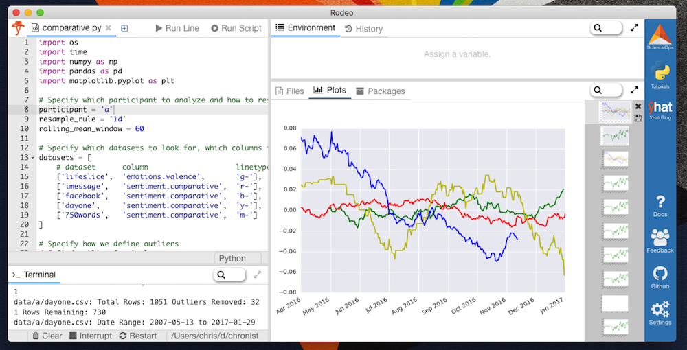
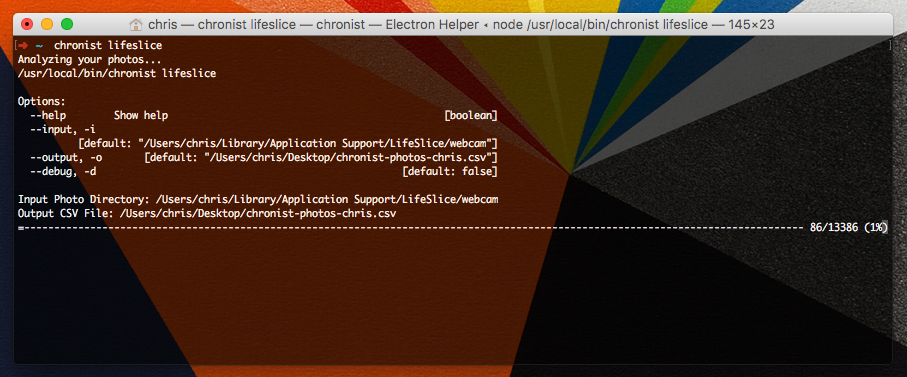
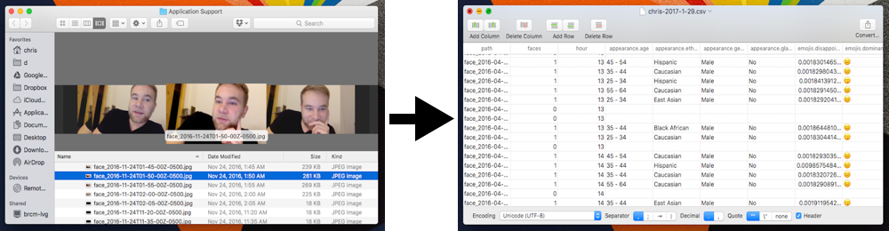

# Chronist

Long-term analysis of emotion, sentiment, and aging using photos and text.



Chronist is a multifaceted project consisting of:

- A command-line tool for gathering chronological sentiment analysis of text from iMessages, Facebook Messenger, [Day One](http://dayoneapp.com/), and [750 Words](http://750words.com/)
- A command-line tool for gathering chronological emotion, age, expression, and ethnicity data from photos
- Python scripts for cleaning and resampling the data generated from these tools for analysis
- Python scripts for generating visualizations (using [matplotlib](http://matplotlib.org/)) of the resulting time-series data
- An anonymous dataset contributed by a few very generous friends who have agreed to donate their real data

The goal of this project is to quantitatively monitor the emotional and physical changes of an individual over periods of time. My thesis is that if you can accurately show emotional or physical change over time, you can objectively pinpoint how an environmental change such as a career change, moving to a new city, starting or ending a relationship, or starting a new habit like going to the gym affected your physical and emotional health. This can lead to important insights on an individual level and for a population as a whole.

If you are interested in hearing more about this project, contributing your data, or collaborating, contact me at [chris@cjroth.com](mailto:chris@cjroth.com).

Chronist's command-line tools were written in Javascript/ES6 for Node.js and its data processing scripts were written in Python.



<!--  -->

## Setup

First, make sure you have Node.js >= 6 and Python 2 or 3 installed.

Then run `npm install -g chronist`.

## Commandline Tool

Run `chronist` to get started. This will show you the available subcommands.

## Gathering Data

#### Lifeslice
This is an alias of `photos` which uses the default Lifeslice photo directory (`/Users/<USERNAME>/Library/Application Support/LifeSlice/webcam`) as its input directory and uses the filenames to detect the dates of the photos. The results will be saved as a CSV on your Desktop by default.
```
chronist lifeslice
```

#### Photos
Run emotion and demographic analysis on a directory of photos. The results will be saved as a CSV on your Desktop by default.
```
chronist photos ~/Desktop/photos
```

#### Facebook
First you'll need to [download your Facebook data](docs/facebook.md), then you can run the sentiment analysis on your Facebook messages - make sure to specify your first and last name as they appear on Facebook with `-n`. The results will be saved as a CSV on your Desktop by default.
```
chronist facebook -i ~/Desktop/messages.htm -n “Chris Roth”
```

#### iMessage
Run a sentiment analysis on the currently logged-in OS X user. The results will be saved as a CSV on your Desktop by default.
```
chronist imessage
```

#### 750 Words
First [download your 750 Words entries](docs/750words.md), then run the sentiment analysis on your entries. The results will be saved as a CSV on your Desktop by default.
```
chronist 750words -i ~/Desktop/750words
```

#### Day One
First [export your Day One journal entries](docs/dayone.md), then run the sentiment analysis on the JSON export. The results will be saved as a CSV on your Desktop by default.
```
chronist dayone -i ~/Desktop/journal.json
```

## Working With Data

Run `pip install -r requirements.txt` to install the Python dependencies. If you do not have pip, you'll need to [install it first](https://pip.pypa.io/en/stable/installing/).

All of the contributed data is stored in `/data` as CSVs. It is first organized by participant, eg `/data/a` is participant `a`'s data. Some participants have different datasets available than others, and each file will likely have data from different date ranges. The analysis will be aware of these caveats.

The scripts to run analyses are in `/analysis`. You can run them with `python analysis/comparative.py` but using [Rodeo](http://rodeo.yhat.com/) is ideal.
